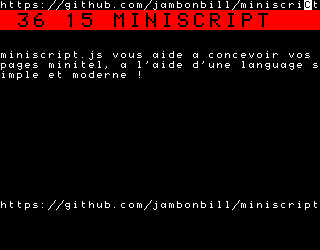

# miniscript.js

miniscript.js est une librairie javascript pour simplifier la conception de pages minitel (ou videotext - vdt) a l'aide d'une syntaxe simple.

    let ms=miniscript().clearScreen();
    ms.down().sizeDouble();
    ms.invert().blink().color("red").write(" 36 15 MINISCRIPT   ");
    ms.goto(0,5).write("miniscript.js vous aide a concevoir vos pages minitel, a l'aide d'un language simple");
    ms.goto(0,20).write("https://github.com/jambonbill/miniscript");
    minitel.send(ms.data);

